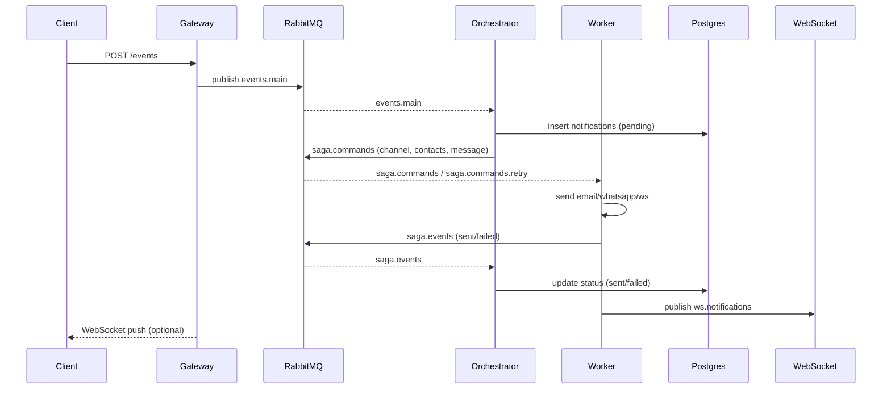

# Архітектура Distributed Notification Platform

Платформа побудована навколо подійно-керованого підходу з RabbitMQ і шаблоном Saga.

## Компоненти
- **Gateway (FastAPI)** — приймає REST `POST /events`, валідуює payload, публікує у `events.main`, тримає WebSocket для доставки в реальному часі.
- **RabbitMQ** — топіки/черги `events.main`, `events.retry`, `events.dlq`, `saga.commands`, `saga.commands.retry`, `saga.events`, `saga.compensations`, `ws.notifications`.
- **Saga Orchestrator** — читає `events.main`, відкриває Saga, створює запис у Postgres, визначає канал доставки, шле команду у `saga.commands`, слухає `saga.events`, оновлює статус, у разі збоїв шле у `events.retry` або `events.dlq`.
- **Notification Worker** — читає `saga.commands`, відправляє Email/WhatsApp/WebSocket, шле результат у `saga.events`, при помилці робить retry через `saga.commands.retry`.
- **PostgreSQL** — таблиці `users`, `notifications`.
- **Prometheus + Grafana** — метрики сервісів, готовий дашборд `notification-overview`.

## Потік подій (Saga)

## Надійність
- **Retry + DLQ** для `events.main` (загальний retry через `events.retry`) та `saga.commands` (через `saga.commands.retry`).
- **Постійні повідомлення** у RabbitMQ (`delivery_mode=2`).
- **Компенсація**: невдалі події потрапляють у `events.dlq`, статуси у БД залишаються `failed`.

## Моніторинг
- Кожен сервіс віддає `/metrics` (Prometheus).
- Дашборд Grafana: пропускна здатність gateway, статуси Saga, успішність worker, активні WebSocket.
